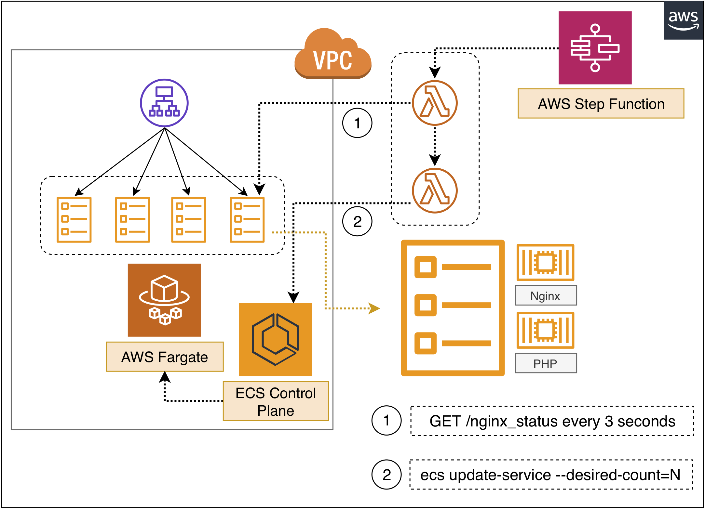
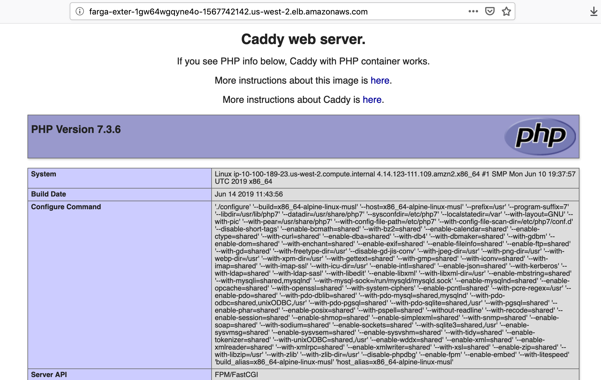
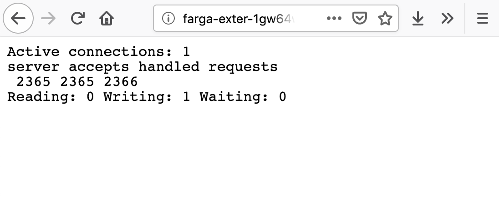
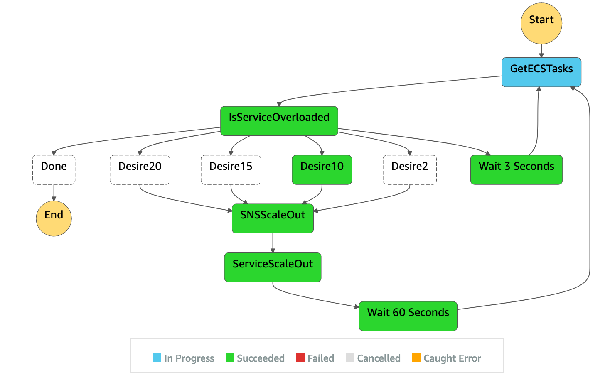

## aws-fargate-fast-autoscaler

AWS Fargate Fast Autosaler - A Serverless Implementation that Triggers your Fargate Autoscaling in Seconds





# How it works

Behind the scene, our workload in PHP, NodeJS, Java or Python is running with a nginx reverse proxy within a single AWS Fargate Task exposing a `/nginx_status` endpoint for realtime connections info generation. All traffic coming through ALB to Fargate tasks will establish active connecitons with the nginx reverse proxy before it can hit our backend server. 

We are running an AWS Step Function state machine to periodically invoke the AWS Lambda function and collect active connection numbers from each Fargate Task **every 3 seconds** and determine our scaling policy in the state machine followed by immediate `ecs service update` to increase the desired number of Fargate tasks.


# Provision with AWS CDK

We will provision the whole environment with AWS CDK.


### checkout the repository

git clone this repository and cd to the `cdk` directory.

```bash
git clone https://github.com/aws-samples/aws-fargate-fast-autoscaler.git
cd aws-fargate-fast-autoscaler/cdk
```

### Setup AWS CDK envorinment

```bash
# install the nvm installer
curl -o- https://raw.githubusercontent.com/nvm-sh/nvm/v0.34.0/install.sh | bash
# nvm install 
nvm install lts/dubnium
nvm alias default lts/dubnium
# install AWS CDK
npm i -g aws-cdk
# check cdk version, make sure your version >=1.0.0
cdk --version
1.6.1 (build a09203a)
# install other required npm modules
npm install
# build the index.ts to index.js with tsc
npm run build
# cdk bootstrapping
cdk bootstrap
```

### Deploy

```bash
cdk synth
# deploy to a specific region
cdk deploy -c region=ap-northeast-1 
```

On deployment complete, you'll see the URL in the Outputs:

**fargate-fast-autoscaling.URL** = http://farga-exter-1GW64WGQYNE4O-1567742142.us-west-2.elb.amazonaws.com

Open this URL and you will see the Caddy web server welcome page with phpinfo.




And if you append `/nginx_status` in the URL and reload the page, you'll see this page:



### Start your state machine

Go to Step Function console and click **start execution** on the state machines. Leave the execution name and input column as is and click **start execution** again. Your state machine will be running. Behind the scene the step function will invoke a Lambda function to collect **Active Connections** number from nginx reverse proxy on each fargate task and determine a new desired number of fargate tasks to scale. Typically it would just take **less than 10 seconds** before it starts to scale.



# SNS Service Integration

The **SNSScaleOut** task in the state machine leverages direct Amazon SNS service integration to publish a notification to your SNS topic. Just update DefaultSNSTopicArn in index.ts with your own SNS topic ARN and you will receive SNS notification everytime it starts **ServiceScaleOut** task.

If you have built your [sns2telegram](https://github.com/pahud/sns2telegram) service, you will be able to receive the SNS message in your Telegram client.


# Disable Scale In

By default, the lambda function will have **disable_scalein=yes** as the environment variable. This will protect your workload from being scaled in accidentally. If you prefer to enable scale in, just remove this environment variable.


# Clean Up

Simply **cdk destroy** to delete all resources in the stack

```bash
# destroy the stack
cdk destroy 
```


## License Summary

This sample code is made available under the MIT-0 license. See the LICENSE file.
